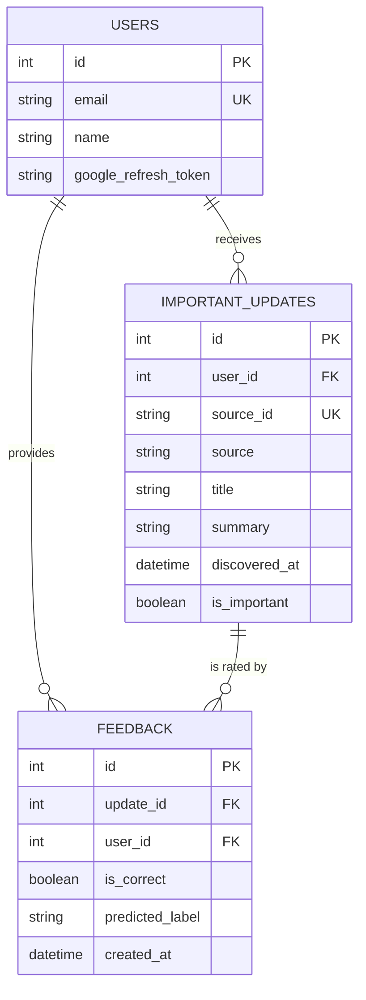

# StudySync Database Schema Guide

The StudySync project uses **SQLAlchemy** (an ORM) to manage its database. This means it is compatible with several database systems (PostgreSQL, MySQL, SQLite, etc.) depending on the `DATABASE_URL` provided in your `.env` file.

---

## 📅 Architecture Overview

The database follows a relational structure to manage users, their classified email updates, and AI feedback loops.

### Entity Relationship Diagram (Conceptual)

---

## 📊 Tabular View of Tables

### 1. `users` Table
Stores basic user information and OAuth tokens for background background background background background services.

| Column Name | Type | Constraints | Description |
| :--- | :--- | :--- | :--- |
| `id` | Integer | Primary Key | Unique identifier for each user. |
| [email](file:///c:/Users/Riaan/OneDrive/Desktop/studysync/backend/app/services/scheduler_service.py#41-110) | String | Unique, Indexed, Not Null | User's email address (used for login and scans). |
| `name` | String | Nullable | User's full name. |
| `google_refresh_token` | String | Nullable | Token used to fetch fresh access tokens for Google APIs. |

### 2. `important_updates` Table
Stores the results of the email classification pipeline.

| Column Name | Type | Constraints | Description |
| :--- | :--- | :--- | :--- |
| `id` | Integer | Primary Key | Unique identifier for the update. |
| `user_id` | Integer | Foreign Key (`users.id`) | Links the update to a specific user. |
| `source_id` | String | Unique, Indexed, Not Null | The original ID from the source (e.g., Gmail message ID). |
| `source` | String | Default: "email" | Origin of the update. |
| `title` | String | Not Null | Structured title including label (e.g., "[DEADLINE] Math Quiz"). |
| [summary](file:///c:/Users/Riaan/OneDrive/Desktop/studysync/backend/app/services/scheduler_service.py#116-206) | String | Not Null | A short snippet/summary of the update. |
| `discovered_at` | DateTime | Server Default: Now | Timestamp when the update was identified. |
| `is_important` | Boolean | Default: True | Flag to prioritize the update in the UI. |

### 3. `feedback` Table
Captures user feedback on AI classification accuracy for future model improvement.

| Column Name | Type | Constraints | Description |
| :--- | :--- | :--- | :--- |
| `id` | Integer | Primary Key | Unique identifier for the feedback entry. |
| `update_id` | Integer | Foreign Key (`important_updates.id`) | The update being reviewed. |
| `user_id` | Integer | Foreign Key (`users.id`) | The user providing feedback. |
| `is_correct` | Boolean | Not Null | True if AI label was correct, False otherwise. |
| `predicted_label` | String | Nullable | The label that was originally predicted by AI. |
| `created_at` | DateTime | Server Default: Now | Timestamp of the feedback submission. |

---

## 🛠️ Which Database is Used?

The project is designed to be **Database Agnostic** via SQLAlchemy.

1.  **Development**: Often uses **SQLite** (e.g., `sqlite:///./test.db`) for simplicity.
2.  **Production**: Typically uses **PostgreSQL** for performance and concurrent background tasks.

**To check or change your database:**
Look at the `DATABASE_URL` entry in your `backend/.env` file.
